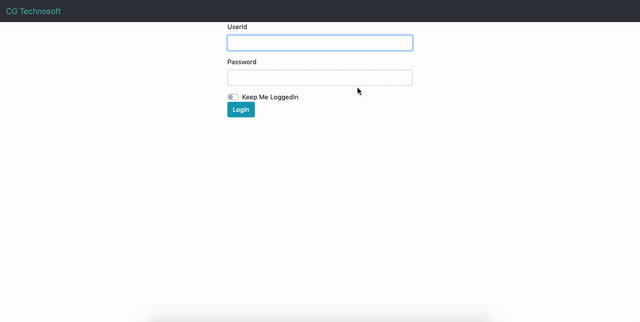

# Univ-DBMS
Django Based ERP system. Making it easier for students as well as teachers to manage their courses. 

## Installation

Use the gitclone method to download the project onto your local system [pip](https://github.com/Arjitc12/Univ-DBMS.git)

```bash
git clone https://github.com/Arjitc12/Univ-DBMS.git
```

## Usage

```bash
cd ~/

cd Univ
```

You can either use a virtual environment and dependencies over there or directly install Django-admin

```bash
virtual env MyEnv -p python3.6
pip install Django==3.0.3
source bin/activate
```


```python
python manage.py runserver
```

And Voila!


## Following are some screen snaps of the project


### Student Login


### Student Registration Portal


### Teacher Login



### Admin Login Screen


## Contributing
Pull requests are welcome. For major changes, please open an issue first to discuss what you would like to change.
